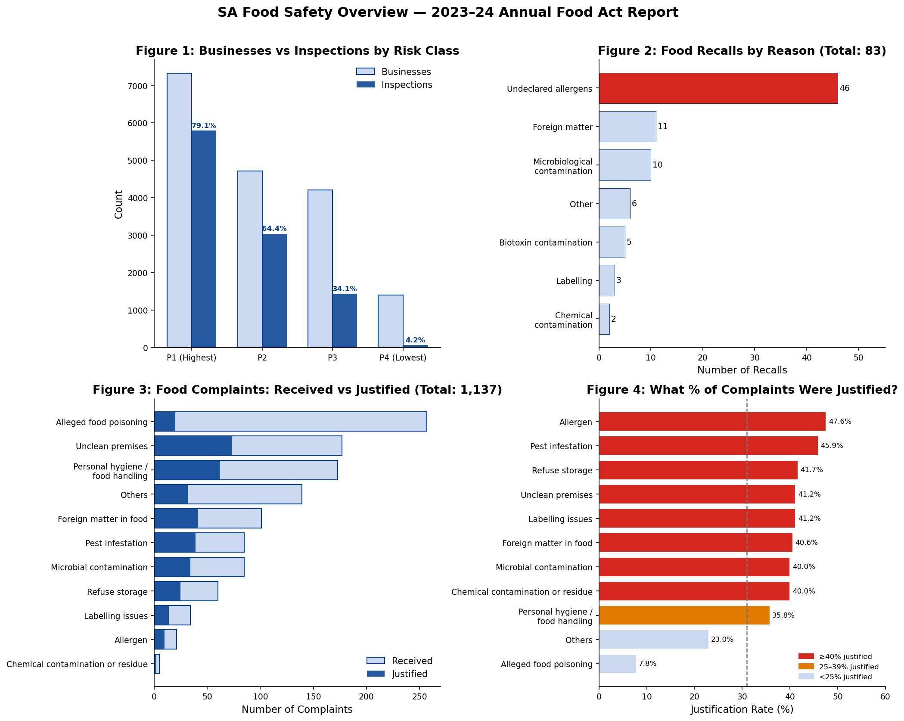

# SA Food Safety Analysis — 2023-24 Annual Food Act Report

An exploratory data analysis of food safety activity across South Australia, using data published by SA Health via [data.sa.gov.au](https://data.sa.gov.au/data/dataset/2023-24-annual-food-act-report-data).

## Overview

The SA Food Act 2001 requires annual reporting on food safety inspections, enforcement actions, complaints, and recall activity. This project analyses the 2023–24 report data to surface patterns in compliance activity, recall drivers, and complaint outcomes across SA.

**Key questions explored:**
- How do inspection rates vary across food business risk classifications?
- What are the leading causes of food recalls in SA?
- Which complaint types are most frequently justified by investigators?
- How effectively are high-risk facilities being audited?

## Visualisations

- **Figure 1 — Businesses vs inspections by risk class:** inspection rates annotated per class, showing the risk-tiered enforcement model
- **Figure 2 — Recalls by reason:** recall counts by cause, with the dominant category highlighted
- **Figure 3 — Complaints received vs justified:** complaint volume by type with justified complaints overlaid
- **Figure 4 — Complaint justification rates:** justification rate per complaint type, colour-coded by rate band, with the overall average as a benchmark

## Key Findings

- 17,652 food businesses are registered in SA. As shown in Figure 1, P1 (highest risk) businesses are inspected at a rate of 79.1% — falling to just 4.2% for P4 (lowest risk) businesses, reflecting a risk-proportionate enforcement model.
- Undeclared allergens are by far the leading cause of food recalls (Figure 2), accounting for 55% of all 83 recalls in 2023–24 — more than the next four causes combined.
- 88% of recalls affected SA (either SA-only or in conjunction with other jurisdictions), underscoring the importance of national recall coordination.
- As shown in Figure 3, of 1,137 food complaints received, only 31% were ultimately justified — with alleged food poisoning having the lowest justification rate at 7.8% (Figure 4), suggesting many reports reflect public concern rather than confirmed violations.
- Allergen complaints had the highest justification rate at 47.6% (Figure 4), consistent with the recall data in Figure 2 pointing to allergen management as a systemic challenge.
- SA Health achieved ≥94% audit completion across all licensed facility types (aged care, child care, private hospitals).

## Data Sources

| File | Description |
|------|-------------|
| `2023-24-number-of-sa-food-businesses-per-risk-classification.csv` | Businesses and inspections by P1–P4 risk tier |
| `2023-24-number-of-food-business-audits-by-local-government.csv` | SA Health audits of licensed facilities by sector |
| `2023-24-food-recalls-data.csv` | Recall counts by type, reason, and jurisdiction |
| `2023-24-food-complaints-actioned-by-local-government.csv` | Complaints received and justified by type |

All data published under [Creative Commons Attribution 4.0](https://creativecommons.org/licenses/by/4.0/) by SA Health.

## Tools Used

- **Python** — pandas, matplotlib, numpy
- **Data source** — SA Government Open Data (data.sa.gov.au / SA Health)
